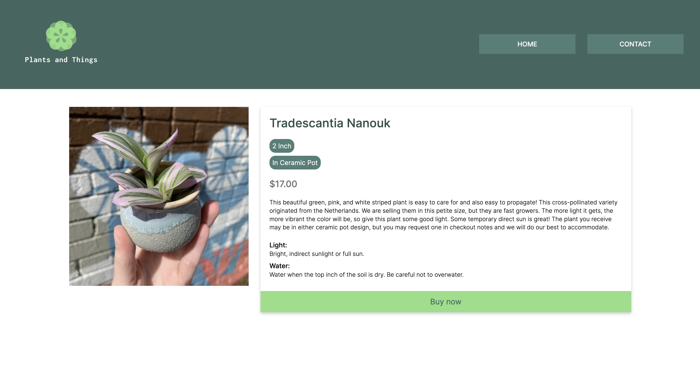
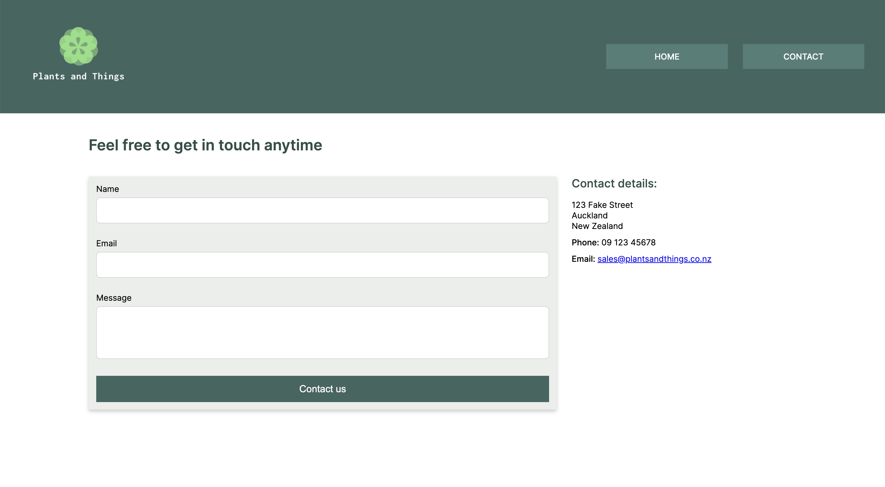

# Example of CSS - Online Plant Shop

## Brief

This was a project for Developers Institute. The wireframes for the website were provided and I coded the html and CSS to fulfill the client brief. 

The website needed to work across multiple screen sizes (mobile, tablet and desktop) and use design principles to make the content easy to read. 
It passes all tests for accessibility. 

## Screenshot of website

## Screenshot of product page

## Screenshot of contact page

## Dev dependencies

- [Prettier](https://prettier.io/)
- [Stylelint](https://stylelint.io/)

## Deployed website

- [Plants and Things website](https://plantsnthings.netlify.app/)